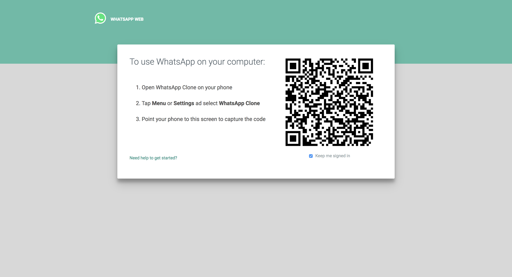
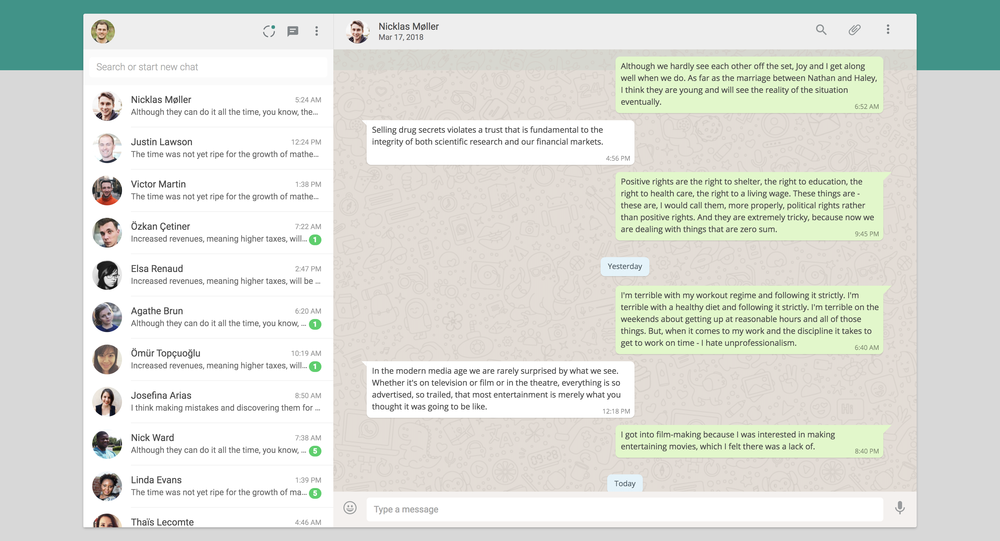

# WebChat | WhatsApp Clone

A clone of WhatsApp Web using the base of WebChat.

- QR Code is generated using [angular2-qrcode](https://www.npmjs.com/package/angular2-qrcode)
- Layout using [@angular/flex-layout](https://github.com/angular/flex-layout) over bootstrap flex.
- Users in threads-list generated using the [RandomUser API](https://randomuser.me/)
- Messages in threads generated using the [Talaikis Quotes Api](https://talaikis.com/api/quotes/)

### Auth screen



### Chat screen



## Proposed Features

- Send and receive messages (real & automated)
- Send different kinds of content as message (images, videos, plain text, emoji)
- Documentation
- Unit testing
- Notifications (new message, battery status, title bar, enable notifications)
- Cherry picking into v2

### NPM Gotchas

- Nodemon repeatedly spawning new processes? Kill it before it kills your machine.
  - Ensure the processes that are being started aren't already running in the background: node, ng, gulp, nodemon, redis-server.
- Redis server error: Redis server binary must be installed on the host machine, the npm library merely references it.
- Sass-loader error: Remove node_modules, clear npm cache and re-install.


### Installation

Download repo and install dependencies:
```
git clone https://github.com/justiceo/whatsapp-web-template
cd whatsapp-web-template
npm install
```

Install redis (for server app):
```
npm i redis
apt install redis-server
```

To start up server (which would serve template):
```
npm start
```

To use angular-cli to serve the web app alone:
```
npm i -g @angular/cli
ng serve
```

### Deploying

Build the UI and server (requires installation of @angular/cli and gulp@4):
```
ng build 
gulp build
```

Install PM2 and start the server (starts webapp at http://localhost:3000):
```
npm i -g pm2
pm2 start dist/index.js
```

There are several ways to view it at http://chat-domain.com, below is one using apache2 proxy (requires mod_proxy):
```
<VirtualHost *:80>
  ServerName  chat-domain.com

  # Point to pm2 or node instance of whatsapp web
  ProxyPass             / http://localhost:3000/
  ProxyPassReverse      / http://localhost:3000/
</VirtualHost>
```
